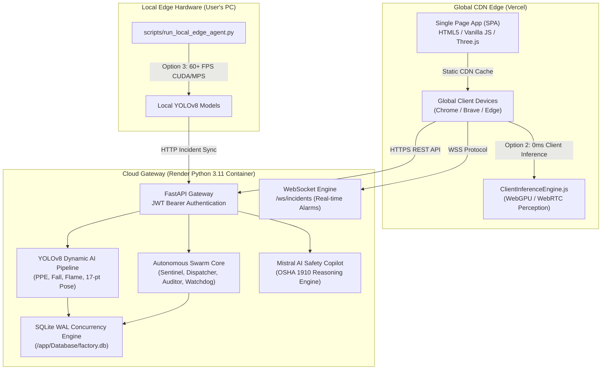

# 🚀 KavachG (कवच-G) — Enterprise Cloud & Edge Deployment Guide

Comprehensive production deployment guide for **KavachG (कवच-G)** by **Team IronLogic**.

---

## 🌐 Live Production Deployments

* **Frontend Portal (Vercel):** [https://kavach-g.vercel.app](https://kavach-g.vercel.app)
* **Safety Command Console:** [https://kavach-g.vercel.app/console](https://kavach-g.vercel.app/console)
* **Backend Cloud Gateway (Render):** [https://kavachg.onrender.com](https://kavachg.onrender.com)
* **Interactive API Swagger Docs:** [https://kavachg.onrender.com/docs](https://kavachg.onrender.com/docs)
* **GitHub Repository:** [https://github.com/GuruMachanica/KavachG](https://github.com/GuruMachanica/KavachG)

---

## 🏛️ System Architecture Topology



---

## 📦 Part 1: Backend Deployment (Render Cloud)

KavachG includes a pre-configured **1-Click Render Blueprint** ([`render.yaml`](render.yaml)).

### 1-Click Blueprint Deployment:
1. Open the [Render Dashboard](https://dashboard.render.com/) $\rightarrow$ **New $\rightarrow$ Blueprint**.
2. Select your repository: **`GuruMachanica/KavachG`**.
3. Render automatically loads [`render.yaml`](render.yaml):
   * **Runtime:** Python 3.11.9
   * **Plan:** Free Tier ($0.00/mo)
   * **Build Command:** `pip install --upgrade pip && pip install -r requirements.txt`
   * **Start Command:** `cd Backend && uvicorn main:app --host 0.0.0.0 --port $PORT`
4. *(Optional)* Provide your `MISTRAL_API_KEY` for conversational safety reasoning.
5. Click **Apply / Deploy**.

---

## 🌐 Part 2: Frontend Deployment (Vercel)

1. Open [vercel.com/new](https://vercel.com/new) $\rightarrow$ Import **`GuruMachanica/KavachG`**.
2. Set **Root Directory** to `Frontend` (or root, using root [`vercel.json`](vercel.json)).
3. Framework Preset: `Other`.
4. Click **Deploy**.
5. The frontend automatically detects and routes all REST & WebSocket traffic to `https://kavachg.onrender.com`.

---

## ⚡ Part 3: Option 2 & Option 3 Edge Perception

### Option 2: In-Browser Client WebGPU Perception
* Open `https://kavach-g.vercel.app/console`.
* In the HUD, click **`📹 Use Laptop Camera`** $\rightarrow$ Click **Allow**.
* Runs real-time PPE and skeletal pose inference directly in your browser with **0 bytes sent to the server**.

### Option 3: Local Edge Node Agent CLI
* Accelerate YOLOv8 on your local NVIDIA RTX or Apple Silicon GPU:
```bash
python scripts/run_local_edge_agent.py --cloud-url https://kavachg.onrender.com --camera 0 --mode ppe
```
* Telemetry and safety violations stream into the cloud dashboard in real time!

---

## 🔐 Master Credentials

| Account | Email | Password | Role |
| :--- | :--- | :--- | :--- |
| **Super-Admin** | `ironlogic.admin@kavachg.io` | `KavachG#Secured2026!IronLogic` | `Lead Security Architect (admin)` |

---

## 👥 Team IronLogic Attribution

* 💻 **Mohammad Saad**: Frontend UI/UX, Command Console & 3D Metaverse Digital Twin.
* ⚙️ **Mohnish Narayan Gupta**: Backend Microservices, Streaming & Security Architecture.
* 🔍 **Ashutosh Mishra**: Computer Vision, YOLOv8 Custom Training & Pose Kinematics.
* 🛡️ **Mohammad Huzaifa** (`GuruMachanica`): Deployment, CI/CD, Autonomous Swarm, Mistral LLM & Database Concurrency.

**Contact:** `ironlogic@zohomail.in`
