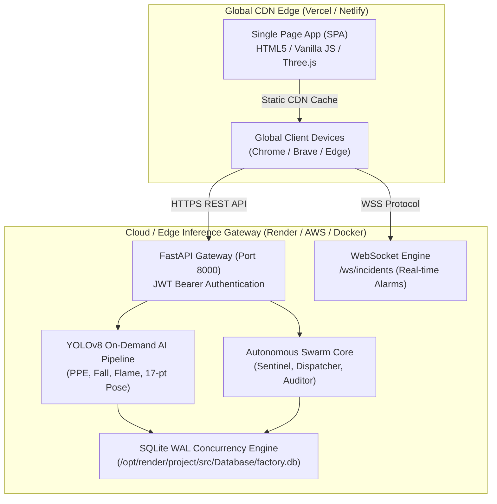

# 🚀 KavachG (कवच-G) — Enterprise Cloud & Edge Deployment Guide

Comprehensive production deployment guide for **KavachG (कवच-G)** by **Team IronLogic**.

---

## 🏛️ System Architecture Topology



---

## 📦 Part 1: Backend Deployment (Render Cloud)

KavachG provides an automated **1-Click Render Blueprint** ([`render.yaml`](render.yaml)).

### Option A: 1-Click Blueprint (Recommended)
1. Push your repository to GitHub: `https://github.com/GuruMachanica/KavachG`.
2. Open the [Render Dashboard](https://dashboard.render.com/) $\rightarrow$ **New $\rightarrow$ Blueprint**.
3. Select the **`GuruMachanica/KavachG`** repository.
4. Render will parse [`render.yaml`](render.yaml) and automatically configure:
   * **Python 3.11.9** Runtime.
   * Auto-installing `requirements.txt`.
   * Web Service running `uvicorn main:app --host 0.0.0.0 --port $PORT`.
   * Persistent 1GB Disk mounted at `/opt/render/project/src/Database`.
5. Click **Apply**.

### Option B: Manual Web Service Setup on Render
1. Click **New $\rightarrow$ Web Service** on Render.
2. Select your repository.
3. Configure settings:
   * **Name**: `kavachg-backend`
   * **Environment**: `Python 3`
   * **Region**: *Choose closest to your facility (e.g., Singapore, Frankfurt, Oregon)*
   * **Branch**: `main`
   * **Build Command**:
     ```bash
     pip install --upgrade pip && pip install -r requirements.txt
     ```
   * **Start Command**:
     ```bash
     cd Backend && uvicorn main:app --host 0.0.0.0 --port $PORT
     ```
4. **Environment Variables**:
   ```env
   PYTHON_VERSION=3.11.9
   ENVIRONMENT=production
   JWT_SECRET_KEY=generate_a_random_32_character_string_here
   ```
5. **Attach Persistent Storage Disk**:
   * Navigate to **Disks** $\rightarrow$ **Add Disk**.
   * **Name**: `kavachg-db-volume`
   * **Mount Path**: `/opt/render/project/src/Database`
   * **Size**: `1 GB`
6. Click **Save Changes** $\rightarrow$ **Deploy**.

---

## 🌐 Part 2: Frontend Deployment (Vercel or Netlify)

### Deploying to Vercel
1. Open [Vercel Dashboard](https://vercel.com/) $\rightarrow$ **Add New $\rightarrow$ Project**.
2. Import **`GuruMachanica/KavachG`**.
3. In **Project Settings**:
   * **Framework Preset**: `Other`
   * **Root Directory**: Click *Edit* and select **`Frontend`**.
   * **Build Command**: *(Leave empty)*
   * **Output Directory**: `.` *(Root)*
4. Click **Deploy**.

### Deploying to Netlify
1. Open [Netlify Dashboard](https://app.netlify.com/) $\rightarrow$ **Add new site $\rightarrow$ Import from Git**.
2. Select **`GuruMachanica/KavachG`**.
3. Netlify will auto-detect [`netlify.toml`](netlify.toml):
   * **Publish directory**: `Frontend`
4. Click **Deploy Site**.

---

## 🔗 Part 3: Connecting Frontend to Cloud Backend

Once your backend is live on Render (e.g. `https://kavachg-backend.onrender.com`), link the frontend:

### Method A: Browser Storage Setting (Zero Rebuild)
1. Open your live frontend app: `https://your-frontend.vercel.app/console.html`.
2. Open Browser DevTools Console (`F12`), paste the following command, and press Enter:
   ```javascript
   localStorage.setItem("apiUrl", "https://kavachg-backend.onrender.com");
   location.reload();
   ```

### Method B: Environment Auto-Detection
Update the production fallback in [`Frontend/functions/core/ApiClient.js`](Frontend/functions/core/ApiClient.js) with your Render domain:
```javascript
this.baseUrl = localStorage.getItem("apiUrl") || "https://kavachg-backend.onrender.com";
```

---

## 🗄️ Part 4: Database Architecture & Integrity

* **Database Engine**: SQLite with **Write-Ahead Logging (WAL)** enabled.
* **Location**: `Database/factory.db`.
* **High-Throughput Configuration**:
  * `PRAGMA journal_mode = WAL;` (Enables concurrent reads during write locks).
  * `PRAGMA synchronous = NORMAL;`
  * `PRAGMA busy_timeout = 10000;` (10s lock retry).
  * `PRAGMA cache_size = -64000;` (64MB memory page cache).
  * `PRAGMA mmap_size = 268435456;` (256MB memory-mapped I/O).

---

## 🐳 Part 5: Docker Container Deployment

To run the complete platform in a self-hosted on-premise industrial server:

### Run with Docker Compose
```bash
# Clone the repository
git clone https://github.com/GuruMachanica/KavachG.git
cd KavachG

# Build and start services
docker-compose up --build -d
```

### Accessing Local Services:
* **Frontend Portal**: `http://localhost:5500`
* **Safety Console**: `http://localhost:5500/console.html`
* **FastAPI Swagger API Docs**: `http://localhost:8000/docs`
* **WebSocket Stream**: `ws://localhost:8000/ws/incidents`

---

## 👥 Team IronLogic — Role Attributions

| Member | Role | Responsibility |
| :--- | :--- | :--- |
| **Mohammad Huzaifa** (`GuruMachanica`) | **Lead Architect & Pipeline** | Cloud Deployment, CI/CD Pipeline, Autonomous Swarm Agents, SQLite WAL Engine & Security |
| **Mohammad Saad** | **Frontend Engineer** | Command Center UI/UX, 3D Metaverse Digital Twin, Glassmorphism HUD Design |
| **Mohnish Narayan Gupta** | **Backend Systems Engineer** | FastAPI REST Architecture, WebSocket Broadcast Streaming, Auth JWT & Services |
| **Ashutosh Mishra** | **Machine Learning Engineer** | YOLOv8 Vision Models, PPE Binding, Fall Kinematics & Thermal Smoke Detection |

---

## ⚖️ License
This platform is distributed under the **Team IronLogic Inspiration-Only License**.  
For commercial inquiries: `ironlogic@zohomail.in`.
