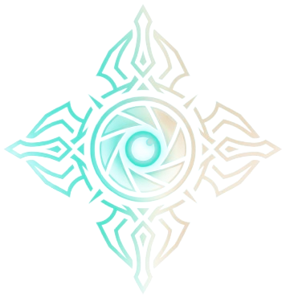

# VajraNetra (वज्रनेत्र) — Autonomous Industrial AI Safety Platform



> **Autonomous Multi-Camera Edge Vision, Skeletal Fall Detection, 3D Digital Twin, and OSHA 1910 Compliance Automation for High-Consequence Industrial Operations.**

---

## 🌟 Executive Overview

**VajraNetra** is an enterprise-grade industrial occupational health, safety, and physical vision defense platform. Built from the ground up for high-hazard environments—including manufacturing assembly lines, heavy machining bays, chemical refineries, logistics centers, and construction sites—it turns standard RTSP/CCTV optical camera streams into continuous, real-time safety auditing engines.

By combining low-latency edge inference with temporal kinematic analysis and 3D spatial twins, VajraNetra eliminates hazard blindness, reduces human inspector fatigue, and delivers sub-50ms automated emergency alerts before workplace injuries occur.

---

## 🚀 Key Platform Capabilities

```
+-----------------------------------------------------------------------------------+
|                           VAJRANETRA COMMAND CENTER                               |
|                                                                                   |
|  [ CAM-01 (Assembly) ]    [ CAM-02 (Hazard Area) ]    [ 3D Holographic Twin ]    |
|   - 10 Workers Tracked     - Proximity Intrusion       - 360° Radar Sweep Cone    |
|   - Hardhat/Vest: OK       - Warning Broadcast         - Acoustic / Thermal IoT   |
|                                                                                   |
|  [ Multi-Camera Stream ]  -->  [ YOLOv8 Edge Vision ]  -->  [ OSHA 1910 Audit ]   |
|   - Sub-42ms Latency            - Person-to-Gear IoU         - Form 301 PDF Auto  |
|   - 60 FPS Dual Channel         - Skeletal Fall Angle        - Compliance Index   |
+-----------------------------------------------------------------------------------+
```

### 1. 🦺 Precision Person-to-Gear IoU Association
* Custom YOLOv8 neural network trained specifically on industrial PPE equipment.
* Performs geometric bounding-box intersection calculations (IoU > 0.45) directly between detected workers and protective equipment (Hardhats, High-Visibility Vests, Respirators).
* Distinguishes between loose unequipped gear on the ground and gear actively worn on the worker's head and torso.

### 2. ⚡ Temporal Skeletal Fall Detection ($\theta < 38^\circ$)
* 17-point full-body skeletal keypoint kinematic model.
* Tracks spine orientation angles and instantaneous downward velocity vectors across temporal sliding frame windows.
* Eliminates false alarms caused by routine crouching, tying shoelaces, or bending down to retrieve fallen tools.

### 3. 🔥 Optical & Thermal Flame Localization
* Continuous edge surveillance identifying early-stage optical flame signatures, toxic smoke plumes, and thermal anomalies.
* Sub-second threat classification triggering real-time Web Speech PA audio announcements and automated email dispatch to plant emergency response teams.

### 4. 🚧 Virtual Point-in-Polygon Exclusion Fences
* Ray-casting point-in-polygon algorithm enabling safety officers to draw interactive hazardous boundary zones directly onto live video feeds.
* Instantly triggers perimeter intrusion warnings when workers enter dangerous crane swing paths, high-voltage substations, or active automated forklift corridors.

### 5. 🌐 Sector Alpha 3D Holographic Digital Twin
* WebGL / Three.js 3D spatial radar sweep visualizer mapping live physical factory coordinates.
* Displays spatial anomaly alerts (`#ERR-Acoustic-99`) with 1-click camera focus jumps, integrated with environmental sensor cards (Thermal Signature, Acoustic dB, VOC PPM).

### 6. 📋 Automated OSHA 1910 Compliance Audits & PDF Generation
* Continuous automated mapping to Federal 29 CFR 1910 safety standards:
  * **OSHA 1910.132 / 135**: Mandatory Personal Protective Equipment
  * **OSHA 1910.28 / 22**: Walking-Working Surfaces & Elevated Fall Arrest
  * **OSHA 1910.38 / 1200**: Emergency Action Plans & Hazardous Chemical Safety
* 1-Click dynamic generation of official **OSHA Form 301 Incident Audit Reports** (PDF) complete with cryptographic hashes, timestamped forensic camera snapshots, and corrective action directives.

---

## 🏗️ Technical Architecture & Tech Stack

VajraNetra is architected with a strict separation of concerns, ensuring maximum edge throughput and zero-cloud dependence:

* **Backend Engine**: Pure **Python 3.11+**, **FastAPI**, **OpenCV (cv2)**, **PyTorch / TensorRT YOLOv8**, **SQLite (WAL Mode)**.
* **Frontend Command Center**: Pure **Vanilla JavaScript (ES6 Modules)**, **Three.js**, **Anime.js**, **jsPDF**, **HTML5 Canvas**, **Web Audio API**, **Web Speech API**.

```
VajraNetra/
├── Backend/
│   ├── api/                   # REST & WebSocket API Routers (Auth, Video, Incidents, Copilot)
│   ├── core/                  # OpenCV capture, stream watchdog, model runtime memory
│   ├── database/              # SQLite database initialization & WAL pool
│   ├── models_ai/             # YOLOv8 PPE, Fall, Flame, Pose, and Copilot reasoning engines
│   ├── services/              # Background workers, clip buffering, and forensic storage
│   ├── scripts/               # Admin seed and management utilities
│   ├── main.py                # FastAPI Application Gateway
│   └── requirements.txt       # Python dependencies
├── Frontend/
│   ├── assets/                # Logos, emblems, 4K industrial CCTV samples
│   ├── functions/
│   │   ├── core/              # StateManager, ApiClient, AudioAlertEngine, VoicePA, PDFReportGenerator
│   │   ├── libs/              # Three.js, Anime.js, jsPDF, html2canvas
│   │   ├── ui/                # Icons.js, ModalManager.js, PlantDigitalTwin.js, ThreeBackground.js
│   │   ├── views/             # Overview, Detection, Digital Twin, Incidents, Copilot, Settings
│   │   └── app.js             # Client bootstrap orchestrator
│   ├── styles/                # Modular glassmorphic and portal stylesheets
│   ├── index.html             # Main Public Landing Portal
│   ├── console.html           # Operator Safety Command Center
│   ├── modules.html           # Dedicated AI Modules Deep Dive
│   ├── demo.html              # Dedicated CCTV Video Player
│   ├── architecture.html      # Enterprise Architecture Specifications
│   ├── compliance.html        # OSHA 1910 Regulatory Mapping
│   └── benchmarks.html        # Verified Edge Latency Benchmarks
└── Models/
    ├── PPE-Detection/         # Custom helmet & vest weights
    ├── Fall_Detection/        # YOLOv8 pose estimation weights
    ├── Fire_Smoke/            # Flame & smoke localization weights
    └── Pose/                  # Skeletal keypoint trajectory weights
```

---

## ⚡ Quickstart & Installation

### Prerequisites
* Python 3.11 or higher
* Node.js / Modern Web Browser (Chrome, Edge, Brave, Firefox)
* CUDA-capable GPU (Optional for TensorRT hardware acceleration)

### 1. Clone the Repository
```bash
git clone https://github.com/GuruMachanica/VajraNetra.git
cd VajraNetra
```

### 2. Configure Backend Environment
```bash
# Create and activate Python virtual environment
python -m venv .venv
.\.venv\Scripts\Activate.ps1   # On Windows (or source .venv/bin/activate on Linux)

# Install required Python dependencies
pip install -r Backend/requirements.txt
```

### 3. Initialize Database & Seed Administrator
```bash
python Backend/scripts/create_admin_user.py
```

### 4. Launch the Platform
In two separate terminals:

**Terminal 1 — Start FastAPI Backend:**
```bash
cd Backend
uvicorn main:app --host 127.0.0.1 --port 8000 --reload
```

**Terminal 2 — Start Frontend Server:**
```bash
cd Frontend
python -m http.server 5500
```

### 5. Access the Web Portal & Command Center
* **Landing Portal**: `http://127.0.0.1:5500/index.html`
* **Command Console**: `http://127.0.0.1:5500/console.html`
* **Interactive API Docs**: `http://127.0.0.1:8000/docs`

---

## 🔒 Security & Privacy Architecture

* **Zero-Cloud Local Inference**: Video processing and inference happen 100% on edge compute nodes. No camera streams are transmitted to external clouds.
* **Cryptographic Token Clearance**: High-privilege actions (threshold adjustments, zone clearing, audit exports) require JWT Bearer signatures.
* **Forensic Evidence Immutability**: All incident clips and snapshots are persisted to disk in the local database with deterministic file hashes.

---

## 📄 License & Intellectual Property

```
PROPRIETARY - STRICT PRIVATE USE & INSPECTION LICENSE
Copyright (c) 2026 Mohammad Huzaifa. All rights reserved.
```

Permission is granted solely to inspect the raw source code, architecture diagrams, and documentation of this repository for private educational study, personal learning, and peer inspection. **Under no circumstances is permission granted to run, deploy, compile, execute, copy, distribute, or host this software or its subcomponents in any operational or commercial environment.**

For commercial licensing, enterprise partnerships, or academic permissions, contact:
* **Author**: Mohammad Huzaifa ([@GuruMachanica](https://github.com/GuruMachanica))
* **Email**: `mdhuzaifa00786@gmail.com`
