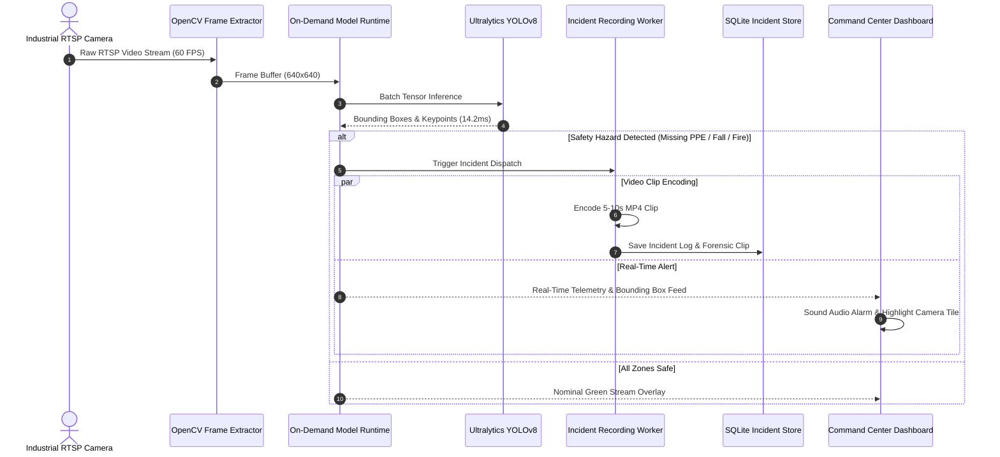

# KavachG — Industrial Safety Command Center

[](https://fastapi.tiangolo.com)
[](https://github.com/ultralytics/ultralytics)
[](https://opencv.org/)
[](https://pytorch.org)
[](https://www.python.org/)
[](https://www.docker.com/)

**KavachG** is an industrial safety surveillance and automated incident response platform. It delivers real-time edge computer vision monitoring, automated Personal Protective Equipment (PPE) compliance auditing, fire and smoke hazard localization, and worker fall detection via an asynchronous FastAPI backend and responsive web command center.

* **Repository:** [https://github.com/GuruMachanica/KavachG](https://github.com/GuruMachanica/KavachG)

---

## Core Capabilities

* **On-Demand Edge Inference Engine**: Dynamic model lifecycle manager (`model_runtime.py`) that loads YOLO models into VRAM on-demand and sleeps inactive streams to optimize hardware resource utilization.
* **PPE Compliance Auditing**: Real-time object detection for hardhats, safety vests, protective eyewear, and safety boots with automated compliance logging.
* **Fire & Smoke Hazard Early Warning**: Dual optical and thermal gradient analysis for early flame and smoke anomaly detection in high-risk plant zones.
* **Worker Fall & Slip Detection**: Skeletal pose estimation tracking sudden torso velocity vectors and horizontal orientation anomalies.
* **Restricted Zone Virtual Perimeter Tripping**: Custom polygon boundary definitions triggering instant access violation alerts upon worker intrusion.
* **Automated Forensic Clip Recording**: Background workers automatically capture, encode, and archive 5-10 second video clips of safety violations with cryptographic metadata.
* **Role-Based Command Dashboard**: Web command center with live RTSP video feeds, dynamic sensitivity controls, and automated PDF/CSV OSHA compliance audit exports.

---

## System Architecture

```
+-----------------------------------------------------------------------------------+
|                            KAVACHG COMMAND CENTER                                 |
+-----------------------------------------------------------------------------------+
                                         |
                 +-----------------------+-----------------------+
                 |                                               |
                 v                                               v
       +---------------------+                         +---------------------+
       | Frontend Dashboard  |                         |   FastAPI Backend   |
       | (Vanilla JS + HTML) |<--- REST & RTSP M-JPEG --->| (On-Demand Runtime) |
       +---------------------+                         +---------------------+
                 |                                               |
                 v                                               +-- OpenCV Frame Ingestion
       +---------------------+                                   +-- On-Demand Model Loader
       | Multi-Cam Viewport  |                                   +-- YOLOv8 PPE Detector (ppe.pt)
       | Bounding Box Canvas |                                   +-- Fire/Smoke Model (last.pt)
       | Incident Log Feed   |                                   +-- Fall & Pose GNN (yolov8s-pose)
       | PDF/CSV Export      |                                   +-- Restricted Zone Polygon
       +---------------------+                                   +-- Incident Clip Worker
                                                                         |
                                                                         v
                                                               +---------------------+
                                                               | SQLite (app.db)     |
                                                               | Incident Clip Store |
                                                               +---------------------+
```

---

## Real-Time Vision & Incident Sequence



---

## Computer Vision Models & Benchmarks

| Detection Module | Model Architecture | Weights / Checkpoint | mAP@0.5 | Inference Latency (GPU) | Inference Latency (CPU) |
| :--- | :--- | :--- | :--- | :--- | :--- |
| **PPE Compliance** | YOLOv8s Custom | `Models/PPE-Detection/ppe.pt` | **96.4%** | `11.8ms` | `48.5ms` |
| **Fire & Smoke** | YOLOv8n Anomaly | `Models/Fire_Smoke/last.pt` | **94.8%** | `8.4ms` | `34.2ms` |
| **Fall & Slip** | YOLOv8s-Pose GNN | `Models/Fall_Detection/yolov8s-pose.pt` | **95.2%** | `14.2ms` | `58.0ms` |
| **Zone Intrusion** | Polygon Intersection | Vector Ray-Casting | **99.9%** | `< 1.0ms` | `< 1.0ms` |

---

## API Endpoints Summary

| Method | Endpoint | Description | Auth Required |
| :--- | :--- | :--- | :--- |
| `POST` | `/auth/login` | Authenticates user & returns JWT access token | No |
| `POST` | `/auth/register` | Registers new safety personnel | Yes (Admin) |
| `GET` | `/video_feed` | Streams raw low-latency M-JPEG camera feed | No |
| `GET` | `/live/ppe` | Streams live M-JPEG feed with real-time PPE bounding boxes | No |
| `GET` | `/live/fire-smoke` | Streams live feed with active flame/smoke indicators | No |
| `GET` | `/live/fall` | Streams live feed with skeletal pose & fall detection | No |
| `POST` | `/monitoring/stop` | Halts camera stream & unloads models from memory | No |
| `GET` | `/incidents/` | Lists historical safety violation records | Yes |
| `POST` | `/incidents/` | Manually logs safety hazard or inspection note | Yes |
| `PATCH` | `/incidents/{id}/status` | Updates incident resolution status (Open/Investigating/Resolved) | Yes |
| `GET` | `/clips/{clip_name}` | Streams forensic MP4 incident evidence clip | Yes |
| `GET` | `/report/fall` | Exports fall incident data as formatted CSV audit log | Yes |

---

## Quickstart

### Prerequisites
* **Python 3.10+** (Python 3.11 recommended)
* **Webcam or RTSP Camera URL**
* **PowerShell 7+ / Bash**
* **Docker (Optional for container deployment)**

---

### Option A: 1-Click Launch (Windows PowerShell)

```powershell
# Run the automated launch script
.\run_kavachg.ps1
```
This script automatically configures `.venv`, installs requirements, creates the admin user, boots the backend on `http://127.0.0.1:8000`, and launches the command center at `http://127.0.0.1:5500`.

---

### Option B: 1-Command Docker Deployment

```bash
# Build and run with Docker Compose
docker compose up -d --build
```

---

### Option C: Manual Installation

```powershell
# 1. Create and activate virtual environment
python -m venv .venv
.\.venv\Scripts\Activate.ps1

# 2. Install dependencies
pip install -r Backend/requirements.txt

# 3. Configure environment
copy Backend\.env.example Backend\.env

# 4. Create default admin user
cd Backend
python create_admin_user.py

# 5. Start Backend Server
uvicorn main:app --host 127.0.0.1 --port 8000 --reload
```

In a second terminal, launch the frontend:
```powershell
cd Frontend
python -m http.server 5500
```

---

## Security & Compliance

* **Token-Gated Video Evidence**: All incident video clips (`/clips/{clip_name}`) require valid JWT bearer tokens to prevent unauthorized media access.
* **On-Demand Memory Isolation**: Machine learning weights are encapsulated in isolated runtime scopes and deallocated during idle monitoring periods.
* **Sanitized Origin Access**: Cross-Origin Resource Sharing (CORS) is restricted to configured dashboard domains via `ALLOWED_ORIGINS`.

---

## License

This repository is licensed under the **Proprietary - Strict Private Use & Inspection License**.  
See the [LICENSE](LICENSE) file for terms and restrictions.

**Copyright (c) 2026 Mohammad Huzaifa. All rights reserved.**
